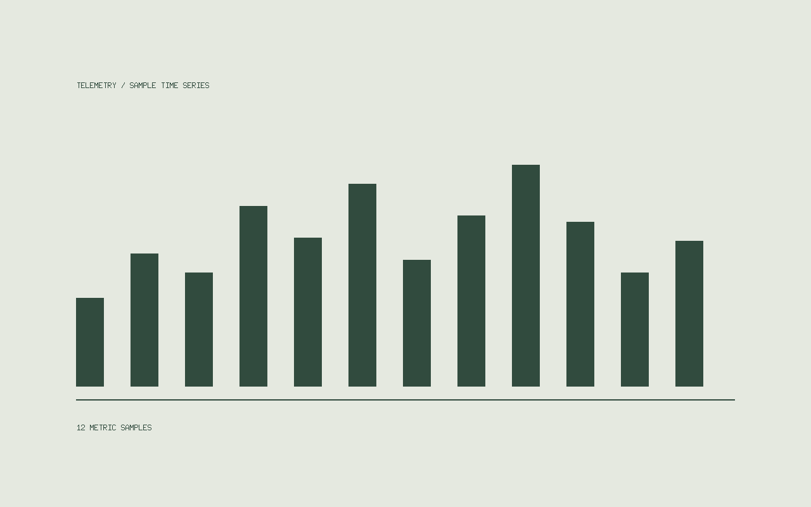

## The idea

A small tool for inspecting time series, event streams, and device logs without third-party cloud aggregators.

This is **sample project content** showing how Alster renders technical notes, code snippets, and inline asset references. Replace this with your own project documentation.

## Design principles

- Plain JSON or SQLite files on disk — no database servers to manage.
- Fast local terminal and browser views for daily inspections.
- Calm, content-first layout with zero analytics scripts.



## A local-first starting point

```go
// Start with a file. Add complexity only when earned.
type MetricPoint struct {
    Timestamp time.Time     `json:"timestamp"`
    Duration  time.Duration `json:"duration"`
    Value     float64       `json:"value"`
}
```

You can also browse the [Ghost themes collection](../ghost-themes/index.md).
