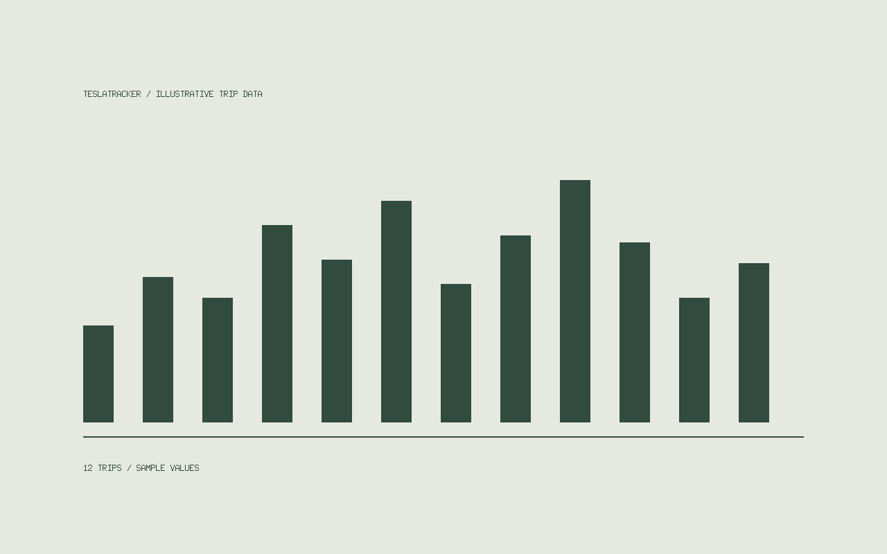

## The idea

A small tool for looking at trips, charging sessions, and the everyday patterns of an electric car.

This is **sample content**, not a description of a released application. Replace it with your own project notes and screenshots.

## Keep the useful parts

- A clear history of trips and charging.
- Data that stays easy to export.
- A small interface with few distractions.



## A local-first starting point

```go
// Start with a file. Add a database when it earns its place.
type Trip struct {
    DistanceKM float64
    EnergyKWh  float64
}
```

You can also browse the [Ghost themes collection](../ghost-themes/index.md).
